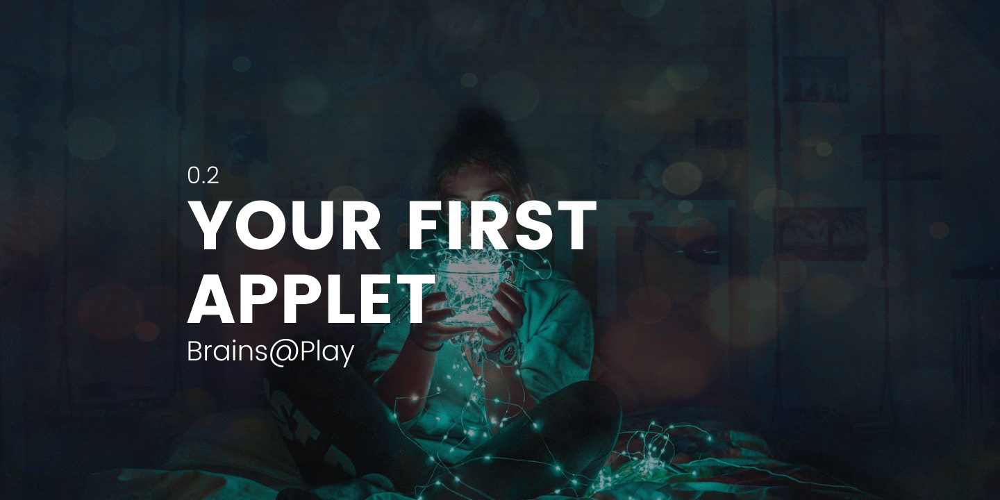

## Overview
---

This tutorial will guide you through the creation and deployment of a web-based brain-computer interface (BCI) application using brainsatplay.js. Learn the basics of JavaScript and design your own multi-user neurofeedback application!

## Clone our Starter Project
---

Head over to our [Brains@Play Starter Project](https://github.com/brainsatplay/brainsatplay-starter) and clone this to your local development environment. 


## Dig into Applet Architecture
---
Brains@Play applications are written as Javascript dictionaries contained in a `settings.js` file. This file contains the essential information to assemble your application, including **metadata** and **graphs**.

### Applet Folder
The `applet` folder contains a `settings.js` file and `UI.js` file. These define the logic and style of your application.

#### UI.js 
The `UI.js` file contains an **output** plugin. These are usually located at the end of your application graph and display results to your user.

#### settings.js
The `settings.js` file contains the required information to assemble your application.
 
```javascript
import { UI } from './UI.js'

export const settings = {

  // App Metadata
  name: "My First Applet", // The name of your applet
  devices: ["EEG"], // Compatible devices for your applet
  intro: {
    mode: 'single' // The default intro sequence for your application. Leave blank for no intro.
  },

  // App Logic
  graphs: [
    {
    id: 'mygraph',
    nodes: [
      {id: 'signal', class: brainsatplay.plugins.Signal, loop: true}, // A default node from Brains@Play that grabs session data

      {id: 'neurofeedback', class: brainsatplay.plugins.Neurofeedback, params: {}}, // A default node from Brains@Play to process session data into neurofeedback outputs

      {id: 'ui', class: UI, params: {}} // A user-defined node for displaying neurofeedback results
    ],
    edges: [
      {
        source: 'signal', // Grab session data
        target: 'neurofeedback' // Convert to the selected neurofeedback output
      },
      {
        source: 'neurofeedback', // Grab the selected neurofeedback output
        target: 'ui' // Display to the user
      }
    ]
  }],
}

```

### index.js
The `index.js` file assembles your applet from the provided `settings.js` file.

```javascript 
import {settings} from './applet/settings.js'

// Load your settings.js file into a Brains@Play Application class
let applet =  new brainsatplay.Application(settings)

// Inject your Application into the DOM
applet.init()

 // Configure a button to connect any Brains@Play-compatible device
applet.session.connectDevice()
```

### index.html
The `index.html` file simply declares `script` tags to import **brainatplay.js** into your project and inject your application into the DOM using `index.js`. 

Since applets fill the space provided to them, we've defined some inline styling to make the `body` tag (default app location) to fill the viewport.

```html 
<!DOCTYPE html>
<html lang="en">
  <head>
    <meta charset="utf-8" />
    <meta name="viewport" content="width=device-width, initial-scale=1" />
    <meta name="description" content="Brains@Play Starter App" />
    <title>Brains@Play Starter Project</title>
    <script src="https://cdn.jsdelivr.net/npm/brainsatplay@0.0.10"></script>
    <script src="./index.js" type="module"></script>
  </head>
  <body style="width: 100vw; height: 100vh; color: white; background: black;">
</body>
</html>
```

## Try It Out!
Now that you understand the starter applet, open the `index.html` to view the neurofeedback application.

## Conclusion
Congratulations on creating your first application with Brains@Play! 

Of course, there's much more that can be done with our framework—but we hope this has inspired you to dive deeper into the growing field of neurotechnology and begin developing fully-featured applications. 

To get the specific data required by your application, head over to the [**Reference**](../reference) page of our documentation. We're so excited to experience what you dream up!
