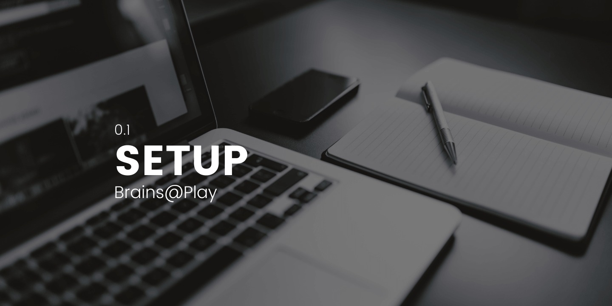

## Overview
---
This tutorial will guide you through setting up a local version of The Brains@Play Platform.

While you've created a simple applet for deployment on the Brains@Play Platform, this applet can also run as a standalone application using only the internal functions and built-in fragment rendering system of our Applet Template. Simply include [our NPM library](https://www.npmjs.com/package/brainsatplay) in your project!

*Details coming soon...*

## Requirements
---

**Node.js:**
Brains@Play requires the latest version of Node.js to build and install its software dependencies. Head to [Node.js Downloads](https://nodejs.org/en/download/) and download the latest version for your operating system.

**A Chromium-Based Browser:**
Limited implementation of [Web Bluetooth](https://caniuse.com/web-bluetooth) and [WebUSB](https://caniuse.com/webusb) requires that you use a Chromium-based web browser like [Google Chrome](https://www.google.com/chrome/) or [Microsoft Edge](https://www.microsoft.com/en-us/edge) to interface with Brains@Play.

## Clone our Github Repository
---

Clone the [brainsatplay](https://github.com/brainsatplay/brainsatplay) repository from Github.

## Install Required Packages
---

Navigate to the root directory of the repository and run `npm install` in your terminal.

## Run the Development Server
---

Run `npm start` in terminal to build and start a development server. 

Now you're ready to [**create your first applet**](./your-first-applet) using brainsatplay.js!