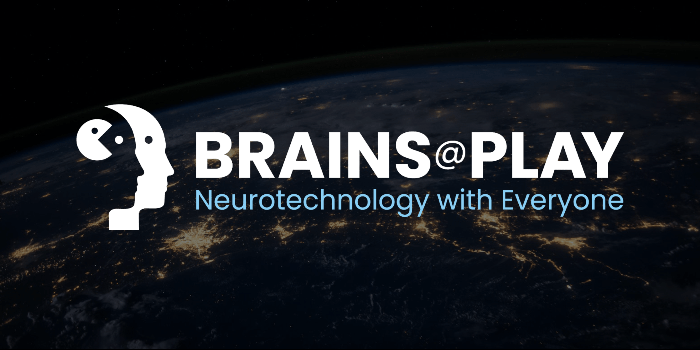

**[brainsatplay.js](https://github.com/brainsatplay/brainsatplay) is an open-source framework for creating brain-responsive applications using modern web technologies.** With this framework, we have developed [The Brains@Play Platform](https://app.brainsatplay.com) to streamline the deployment of applications built by and for our community.

## Why Brains@Play?
---

**Everyone has a brain.** So why not develop applications accessible to all of them? The main benefits of brainsatplay.js include:

### Device-Agnostic Data Acquisition
Stream raw data over Bluetooth Low Energy or Serial. We currently support hardware from a variety of popular neurotechnology companies (e.g. [OpenBCI](https://openbci.com/), [Muse](https://choosemuse.com/), [Neosensory](https://neosensory.com/), [FreeEEG](https://www.crowdsupply.com/neuroidss/freeeeg32), [HEGAlpha](https://www.hegalpha.com/)) and have documentation to rapidly [add your device](./advanced-topics/add-your-device) to this list.

### Plug-and-Play Algorithms
Derive useful information from brain data in real-time—all locally on your web browser!

- Fast Fourier Transform (FFT), including bandpowers
- Coherence
- Blink Detection

### Advanced Networking Capabilities
Securely stream brain data over the internet to support social experiences and/or remote data collection. 

### Rapid App Development
Worry less about the basics and focus on creating high-quality user experiences!

## How to Contribute
---

### Build an Application
Head over to **Getting Started** to learn how to build your first application with brainsatplay.js.

### Expand the Ecosystem 
Explore **Advanced Topics** to begin extending the functionality of brainsatplay.js for other developers.

### Claim BCI Bounties
The [USC Bridge Arts and Science Alliance](https://uscbasa.wixsite.com/mysite) has generously provided $2000 to fund "BCI Bounties" to solve hard problems in the neurotechnology space with Brains@Play. While we have yet to release this initiative, you can expect bounties on the following topics:

- [ERP Recognition](https://www.frontiersin.org/articles/10.3389/fnins.2017.00109/full) over Web BLE by replicating [Brain Invaders](https://arxiv.org/pdf/1409.0107.pdf) ($250)
- An [SSVEP](https://ieeexplore.ieee.org/document/8553012) speller ($250)
- [WebRTC](https://webrtc.org/) implementation for peer-to-peer data streaming ($250)
- [Automated artifact rejection](https://gitlab.ciirc.cvut.cz/open-source/rps) for online BCI experiments ($100)
- Unity, Unreal, and Godot plugins ($50 each)
- [Timeflux UI](https://github.com/timeflux/timeflux_ui) integration ($50)
- [BCI2000](https://www.bci2000.org/) integration via [BCI2000Web](https://github.com/cronelab/bci2000web) ($50).
- [MOABB](https://github.com/NeuroTechX/moabb) integration ($50).
- Project [Warioware](https://www.youtube.com/watch?v=tdyq57OCXn8): "Micro-games" for single and multiplayer use ($5 per entry)

Each technical bounty must be accompanied by a demo applet showcasing the new feature.

## Getting Started
---

We're so excited to have you as part of the Brains@Play community! Head over to [**Setup**](./getting-started/setup) to clone our Github repository and begin participating in the future of neurotechnology!

### Explore the Reference
Extensive references to the brainsatplay.js software library can be found on our [**Reference**](./reference) page.

### Ask for Help
If you have questions about developing with Brains@Play, feel free to start a conversation on [Discord](https://discord.gg/tQ8P79tw8j) or reach out directly to our team at [contact@brainsatplay.com](mailto:contact@brainsatplay.com).

### Provide your Feedback
To provide feedback on the documentation, create new issues at [brainsatplay/brainatplay](https://github.com/brainsatplay/brainsatplay). If you have brainsatplay.js questions, or issues with the codebase, please open new issues at [brainsatplay/brainatplay](https://github.com/brainsatplay/brainsatplay) as well.